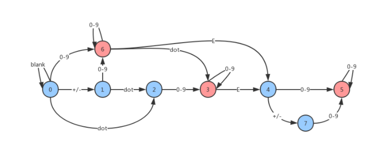

[返回上一页](../index.md)

# <center>有效数字与计算图模型</center>

[有效数字](https://leetcode-cn.com/problems/valid-number/)

- 这道题是我第一遍刷题时就跳过的一道题，，，因为当时的我太菜了，也没有学过编译原理。看到有限自动机这个fancy的名字，我就被吓到了，于是就跳过了这道题。之后在ucsd上haskell这节函数式编程课之后，刚好要写一个小编译器，里面所学到的State Monad完全可以cover这道题。时隔一年，重新审视这道题，暗喜于这小半年上课没有白费。
- 核心理念就是把每个小函数抽象成一个计算节点（纯函数）（有点像Tensorflow中的计算图模型），规定好每个计算节点的输入为一个字符，计算内容是根据输入判断下一步走向哪一个节点，输出是下一个节点的编号/指针。如果最后落在了可以当作结束位置的点就表明成功，反则失败。这里采用了表驱动的方法，因为速度会快很多。
- 跳表的每一行代表一个节点，因为一共有四种字符 +-算一种 数字算一种 小数点算一种 e算一种，所以每个节点内部根据四种输入字符分别列出下一步将跳往哪个节点。
- 结点的数量要根据画出的状态图来决定。画出基础的状态图后，如果两个节点的输出是完全一致的（对应跳表某两行完全一致），那么这两个节点就可以合并为一个节点。最终这道题，加上输入节点之后，可以简化为9个节点。
- 

```c++
#include<iostream>
using namespace std;
vector<vector<int>> jumpTable = {
    {1,  3, -1,  2},
    {-1,  3, -1,  2},
    {-1,  4,  6,  2},
    {-1, -1, -1,  5},
    {-1, -1,  6,  5},
    {-1, -1,  6,  5},
    {7,  -1, -1,  8},
    {-1, -1, -1,  8},
    {-1, -1, -1,  8}};
unordered_set<int> endPoints = {2,4,5,8};
unordered_map<char,int> m = {
    {'+',0},
    {'-',0},
    {'.',1},
    {'e',2},
    {'E',2}};
class Solution {
public:
    int typeMap(char c){
        if(m.find(c) != m.end()) return m[c];
        if( isdigit(c)) return 3;
        return -1;
    }
    
    bool isNumber(string s) {
        int current = 0;
        for(char c: s){
            int type = typeMap(c);
            if( type == -1) return false;
            current = jumpTable[current][type];
            if(current == -1) return false;
        }
        if (endPoints.find(current) != endPoints.end()) return true;
        return false;
    }  
};
```

- 函数式的做法大同小异，在这里函数被抽象成了计算图，所有的计算不是在数据上的计算而是在函数上的计算。monad中的bind被我简化成了do。函数式yyds！（头一次体会到haskell的简洁
- 这种做法的好处在哪呢，好处就在于如果你背下了bind函数，那么所有这一类问题都可以像搭积木一样垒起来而不用考虑各种奇奇怪怪的edge case

```python
# 定义好return 和bind
ok = lambda s : [s]
def do(*parsers):
	parser = lambda s, i=0: sum([ parser(rest, i+1) for rest in parsers[i](s)], []) if i<len(parsers) else [s]
	return parser
#定义辅助函数
orAnd = lambda parsers: lambda s: sum([ parser(s) for parser in parsers], [])
def orElse(*parsers):
	parser = lambda s, i=0: parsers[i](s) or parser(s,i+1) if i<len(parsers) else []
	return parser
def manyP(parser):
	f = lambda s: sum( [orElse(f, ok)(ss) for ss in parser(s)], [])
	return f
# 搭积木
satP = lambda judger: lambda s: [] if s=="" or not judger(s[0]) else [s[1:]]
charP = lambda c_: satP(lambda c:c==c_)
digitCharP = satP(lambda c: ord('0')<=ord(c)<=ord('9'))
signP = orElse(charP('+'), charP('-'), ok)
intStringP = manyP(digitCharP)

signedIntP = do(signP, intStringP)
option1P = do(intStringP, charP('.'))
option2P = do(intStringP, charP('.'),intStringP)
option3P = do(charP('.'), intStringP)
floatP = do(signP, orAnd(option1P, option2P, option3P))
eIntergerP = do(orElse(charP('e'),charP('E')), signedIntP)
validNumberP = do(orAnd(floatP, signedIntP), orAnd(eIntergerP, ok))
```

