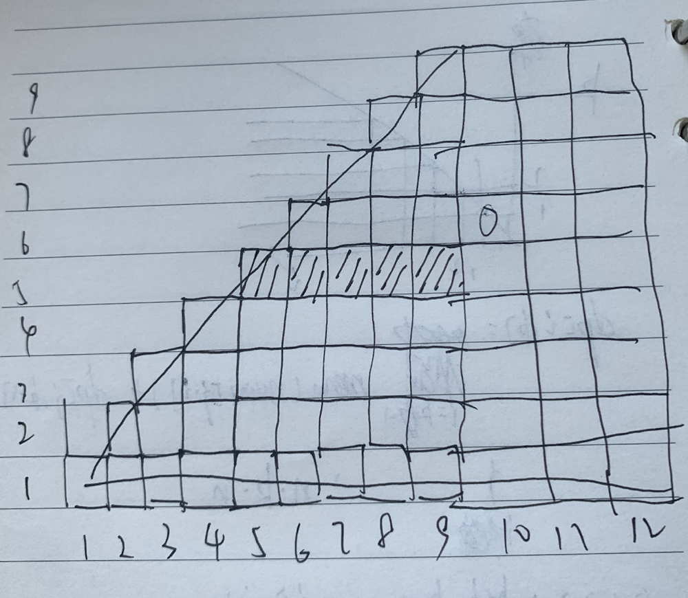

[返回上页](..)

这又是一道非常典型的partition 问题啊，

所有的partition问题基本都是这种解法， 从数组0-i的最后一个partition的起始位置来考虑dp

一般是这种形式 i代表数组的0-i-1这长度为i的这一段，k代表分为k个partition，很显然为了有意义i必须大于等于k

dp[i, k] = someFunction（  [ dp[j, k-1]    for  j  in  range(k-1，i) ]  ）

j从k-1开始是为了让j大于等于k-1

如果画图的话可以总结出如下规律

要求出dp[i, k]，需要dp[k-1~i-1, k-1]

也就是为了求出dp[10, 6],我们需要

dp[5,5] dp[6,5] dp[7,5] dp[8,5] dp[9,5]

所以i和k都要从小往大遍历



同时我们可以注意到，只需要初始化dp[1,1] dp[2,1] dp[3,1] ... dp[n,1]就可以了，对角线上的可以通过dp式子算出来。

所以如果定下了推导公式

F ::  nums -> i -> kk -> dp[k-1~i-1, k-1] -> dp[i, k] 

和初始条件 G :: nums -> i -> dp[i, 1]

我们就可以写出如下模版

```python
def getAnswer(nums, k):
  n = len(nums)
  dp = [[0] * (k+1) for _ in range(n+1)]
  # 这块不要也行，就是个helper用来快速算区间和
  self.prefix = [0] + nums
  for i in range(2, n+1):
    self.prefix[i] += self.prefix[i-1]
  
  # initialization
  for i in range(1,n+1):
    dp[i][1] = self.G(nums, i)
 
	#traverse to get dp[n, k]
  for i in range(2, n+1):
    for kk in range(2, min(i, k)+1):
      dp[i][kk] = self.F(nums, i, kk, [ (dp[j][kk-1], j) for j in range(kk-1, i)] )
  return dp[n][k]
```

在这道题里，F和G分别为

```python
def F(self, nums, i, kk, dps):
  return max( [ self.rangeSum(j,i)/(i-j) + dp  for dp, j in dps] )
    
def G(self, nums, i):
  return self.rangeSum(0,i) / i

def rangeSum(self, st, ed):
  # return the sum of nums[st:ed]
  return self.prefix[ed] - self.prefix[st]
```

